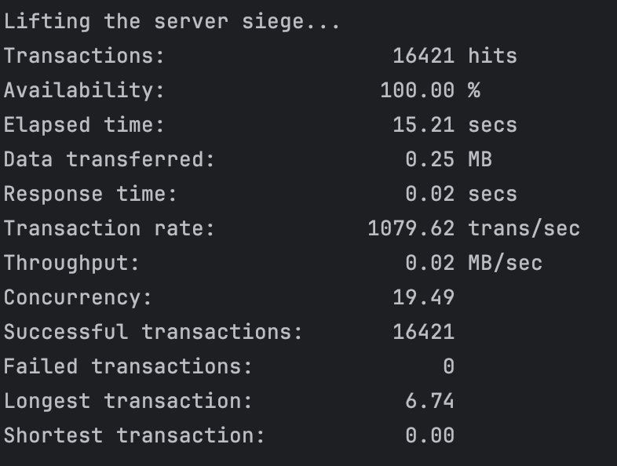

# HSA10  5. Stress Testing. Approaches and tools

# Homework 5

# Requirements
* docker-compose
* siege

# 1. Run services
```
docker-compose up --build -d
```

# 2. Use test.sh script to test with siege
```
./test.sh
```

# 3. Check result
# 10

# 25

# 50

# 70

# 100
